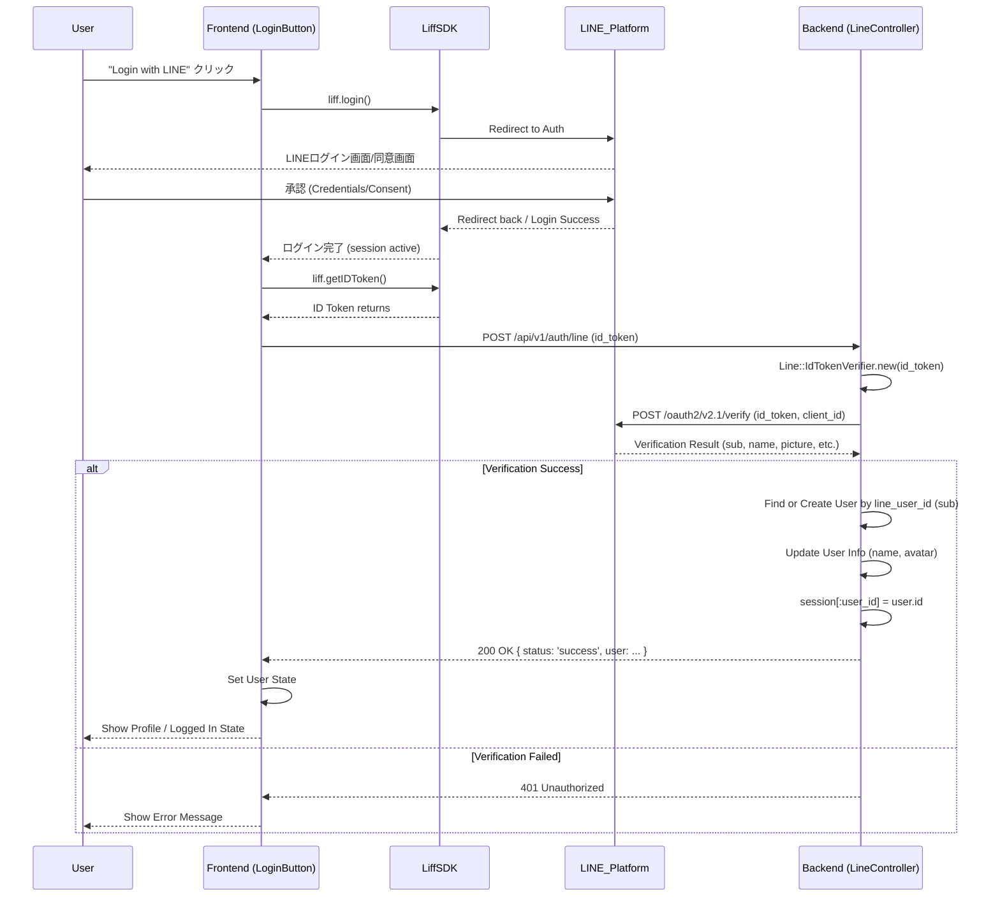
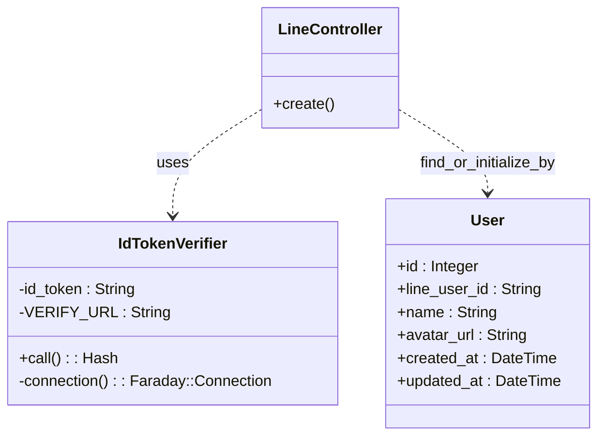

# LINE Login

## 設計の概要

本アプリケーションのLINEログインは、LIFF (LINE Front-end Framework) を利用したID Tokenベースの認証フローを採用しています。
フロントエンドで取得したID Tokenをバックエンドに送信し、バックエンドでLINEプラットフォームの検証APIを用いて検証を行うことで、セキュアな認証を実現しています。

### アーキテクチャ

*   **Frontend (Next.js)**: LIFF SDKを使用してLINE認証を行い、ID Tokenを取得します。取得したID TokenをバックエンドAPIに送信します。
*   **Backend (Rails API)**: 受け取ったID TokenをLINEプラットフォームの `verify` API に問い合わせて検証します。検証に成功した場合、ユーザーを特定（または新規作成）し、サーバーサイドセッション (Cookie) を発行します。

### シーケンス図

### クラス図 (Backend)

認証処理に関わる主要なクラス構成です。

### 実装詳細

#### Frontend
*   `LiffProvider`: アプリケーション全体でLIFF SDKの初期化状態を管理するContext Provider。
*   `LoginButton`: ログインボタンのUIコンポーネント。`useLiff` フックを使用してLIFFの状態にアクセスし、ログインフローを制御します。
*   `api.ts`: その他のAPI呼び出し関数の定義。`authWithLine` 関数が含まれます。

#### Backend
*   `Api::V1::Auth::LineController`: 認証のエントリーポイント。
*   `Line::IdTokenVerifier`: LINEプラットフォームへの検証リクエストをカプセル化したService Object。Faradayを使用してHTTPリクエストを行います。
